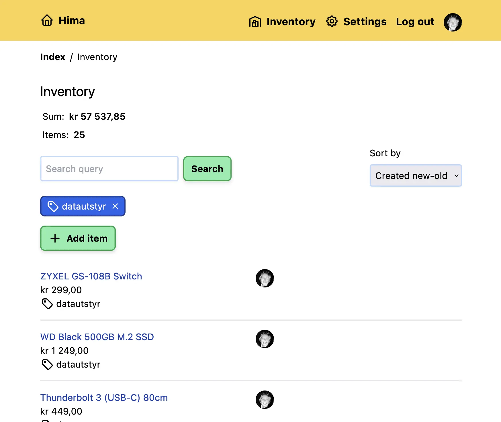

+++
title = "March 2023"
description = "What I've been up to since February."
tags = ["Recently", "100 days to offload"]
+++

## 🌳 Life

Our apartment is listed for sale! Looking forward to getting something bigger
when we sell, in the meantime we're living with the in-laws. Was a bit hectic
moving all of our stuff out in such a short time, in retrospect I would've
planned better.

Right now I've had some time off work because of a official Norwegian holiday
during easter. Been enjoying this time off and only doing leisure stuff!

## ✍️ Blogging

It's been another quiet month, also more than a week late with this post 😅 I
have a few posts in the backlog, I'm hopeful!

## 💪 Health

Been running a bit more, not as frequent as January but a bit more than
February. Also ran another "competetive" half-marathon, the last one before the
summer.

During easter now I managed to try out some more bouldering, tried Padel for the
first time and went trail running. It's fun to try new things!

## 👨‍💻Development

During the weekends and easter I've managed to put together a small web
application made in [Deno Fresh][d_fresh] (with [PocketBase][pb]) for Home
Inventory Management. It's called [Hima][hima], which means "home" in a
Norwegian dialect and could be used as a acronym for "Home Inventory Management
Application".

<figure>
  
  <figcaption>
    What Hima looks like as of today.
  </figcaption>
</figure>

It's open source and the source code is available on [Sourcehut][hima]. It's
been really fun learning Deno Fresh and doing more custom server-side stuff.

Some cool features:

- Built-in authentication via PocketBase.
- Works without client-side JS.
- Super fast!
- Works great on both mobile and desktop.

I have a roadmap for a `v1.0.0` release and you can find that on my [Sourcehut
TODOs][hima-todo]. Not sure if all the todos are laid out yet, but it's a start
and I'm just doing it for fun (and because I think it's useful). I'm planning on
setting up a Demo-page where people can try out the application and see how it
works.

## 🎬 Entertainment

### Movies

- **Aftersun** – A very quiet movie about a father and daughter. The movie
  itself could be looked at as a bit boring, but the story it told was
  interesting.
- **John Wick: Chapter 4** – Action, action and more action. Keanu is doing what
  he does best. There were a few super cool action moments and the bird-eye-view
  one-shot scene was really cool!

### TV

Finished The Last of Us S01, a great show! I really liked that they made it as
close to the original game as possible. Had such a great time watching it!

[d_fresh]: https://fresh.deno.dev/
[pb]: https://pocketbase.io/
[hima]: https://sr.ht/~timharek/hima/
[hima-todo]: https://todo.sr.ht/~timharek/hima
