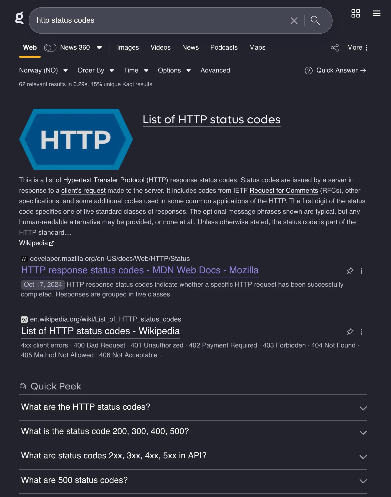
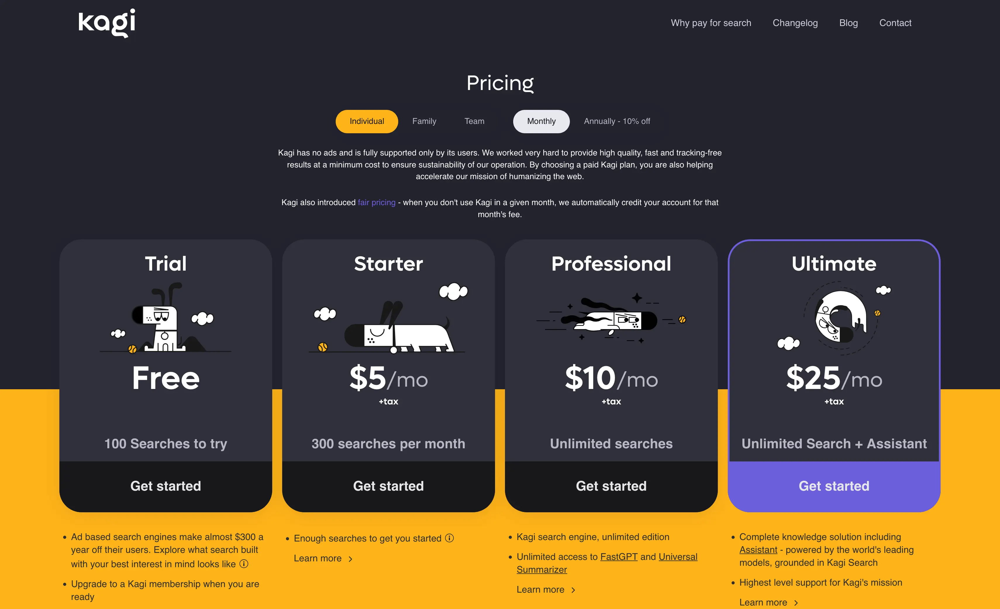

+++
title = 'Kagi review'
description = 'What I think about the independent search engine after 500 days.'
tags = ["Kagi", "Review", "Search engines"]
+++

[Kagi] is a paid ad-free search engine. The goal of Kagi is to provide its user
with great search results instead of ads, ads, and more ads for stuff you didn't
ask for. This is my review for Kagi after using it for 500 days.

## Features

The search engine isn't just free of ads, it has features Google, and even
DuckDuckGo doesn't have.

- No ads
- Ability to block and boost domains
- Surfaced high quality content
  - Stuff from smaller sites grouped in a list.
- Lenses
  - Focus on different topics regarding the query.
- Bangs
  - Works just like DuckDuckGo's, `Spider-Man !tmdb` brings you straight to The
    Movie Database's website with Spider-Man already searched for.
- Privacy by design
  - They sell a subscriptions, not ads or data.
  - Zero telemetry, zero tracking.
- Surface interesting, exploratory results
- Appearance customization
- Details for each results
  - Are there trackers, ads, website speed, language etc. Kagi will let you know
    before click the result.
- Comprehensive result filtering
  - Sort by the number of ads/trackers per result (😂)
- Keyboard shortcuts
- AI summaries
  - Add a `?` at the end of the query, and Kagi will use the most relevant
    results to give you a summary of what you are searching for.

## Why I pay for search

This has been something friends and family have lifted their eyebrows for, why
do I pay for a service, when there's a free one "that just works"? I don't want
to be the product, I don't like advertisements, I don't want to be tracked
across my searches. I want answers to my queries, I want to learn. I don't want
to buy more stuff I don't need.

Kagi's words for why you should pay for search makes sense:
[Why pay for search](https://help.kagi.com/kagi/why-kagi/why-pay-for-search.html)

## Search results

As mentioned earlier, Kagi doesn't do ads. And you notice that if you come from
a search engine like Google. Let's take the simple query
`online degree programs`. I get four sponsored results before I actually see the
first organic result, with Kagi, I see the first organic result straight away,
and no mention of the ones that pay for advertisement-placement.

<figure>
  
  <figcaption>
    Screenshot of Kagi's results vs Google's.
  </figcaption>
</figure>

The same is for looking for specific product reviews, services near you etc. Now
you find the ones that has good quality content first. And if you're like me,
and often look up random facts, terms, etc., you might like to check Wikipedia.
Well, with Kagi you can boost Wikipedia (or any site) to show up earlier in the
result or even pin it to the top if there's a matching result. And you can also
do the opposite, you can lower the rating of a site or block it completely.

Since I do a lot web related development, I often check Mozilla's web docs
(MDN). Therefore, I have made it a pinned site, so if I search for
`http status codes`, MDN will be first.

<figure>
  
  <figcaption>
    Screenshot of how my Kagi result look like for "http status codes".
  </figcaption>
</figure>

## AI

I know, I know, AI is all the hype these days. Everyone is adding it to their
products, names etc., but hear me out when I say that Kagi's AI features is
actually useful.

### Search

When you search for something, eg. `should i pick my nose` and just add a simple
question mark at the end: `should i pick my nose?`, you get something like this:

<figure>
  
  <figcaption>
    Screenshot of Kagi's AI summary of search query.
  </figcaption>
</figure>

As you can see, it gives a summaried answer based on the actual results with
references. So you still get to decide if you want to go deeper.

### Content

Sometimes you come across an interesting post, article, video and so on.
Sometimes these are long, and sometimes you don't have time. And sometimes you
want to know if you should spend time on it. This is where Kagi's Unviersal
Summarizer comes in. If you do a query for a specific URL, eg. a previous of
mine, [Playdate review](/blog/playdate-review), and add the [bang](#features)
`!sum`, you will get something likes this
`!sum https://timharek.no/blog/playdate-review/`:

<figure>
  
  <figcaption>
    Screenshot of Kagi's AI content summary.
  </figcaption>
</figure>

It even works for videos. I sometimes use it for videos I haven't seen in a
while to check if there's mention of a specific topic I'm researching etc.

## Mobile search

This is where Kagi fell short for me, initially, although it's not their fault.
Since I use an iPhone, I have to use iOS, and both Kagi and I have to adhere to
Apple's rules when it comes to browsers and search engines.

In order to use Kagi on iOS without having to go to `kagi.com` every time, you
have to download an app because you can change from the defaults on iOS. But
even with the app it's complicated, because the app is a Safari-extension and
you have to give special permissions etc. I will not go through all the steps
here, but you have to follow a 5-step guide in the app, with additional
video/GIF instructions. They also have
[guide online](https://help.kagi.com/kagi/getting-started/setting-default.html#setting_up_extension_safari_ios).

The onboarding process is much better today than it was when I started using
Kagi in October 2023. Now I hope Apple makes it easier to just change the
default search engine in the settings, other than the default engines provided.

## Pricing

They have different tiers of pricing:

1. Individual
1. Family
1. Team

<figure>
  
  <figcaption>
    Screenshot of Kagi's pricing page.
  </figcaption>
</figure>

You can pay monthly or annually with a 10% discount. They have a trial pricing
where you get to use Kagi for free for 100 searches a month. I think it took me
two days to use up my trial back in 2023. You can see the actual pricing on
[their website](https://kagi.com/pricing). And they have something called
[fair pricing](https://kagi.com/changelog#6155), if you don't use the service
for a given month, they won't charge you.

I have paid for Kagi for the last 500 days with a Duo-family account where 2
accounts get unlimited searches for $14 per month.

My view on the actual price is that it's worth it. I search for stuff every
single day, multiple times a day. And I want good results, not ads. I might
prompt my workplace to subscribe to Kagi Team to support Kagi even more.

## Alternatives

There are
[other alternatives to Google](https://alternativeto.net/software/google-search/),
like DuckDuckGo, Startpage, Qwant, etc. However, most of these alternatives have
[ads](https://duckduckgo.com/duckduckgo-help-pages/company/how-duckduckgo-makes-money/)
[in](https://www.startpage.com/privacy-please/startpage-articles/whats-startpages-revenue-model)
[their](https://help.qwant.com/en/docs/overview/how-does-qwant-make-money/)
results in order to make money.

## Conclusion

Kagi is an excellent search engine, and the perfect alternative to Google. I
like knowing that I pay for a service that provides me with value from the
get-go. I really appreciate being able to tailor my results based on my
preferences when it comes to site I like and not like. I love not wasting my
time by being able to get a quick summary for a topic I'm quickly researching or
being able to dive deeper into a topic based on a summary.

If you want to break free from Google, or other free search engines, I highly
recommend [Kagi].

Other reviews:

- Dann Berg: https://dannb.org/blog/2023/how-kagi-beats-google/
- Kev Quirk: https://kevquirk.com/blog/my-thoughts-on-kagi-search
- FlatFootFox:
  https://flatfootfox.com/a-three-month-review-of-kagi-search-the-orion-web-browser/

[Kagi]: https://kagi.com
