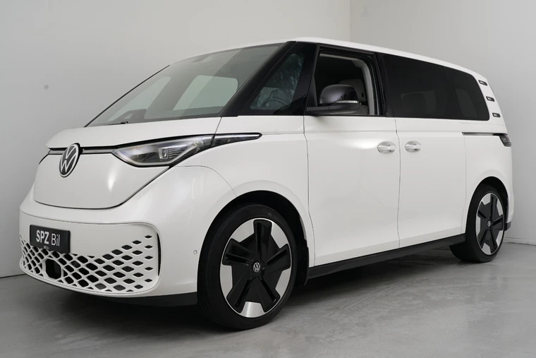

+++
title = "Volkswagen ID. Buzz first impressions"
description = "My first impressions after buying a used ID. Buzz."
tags = ["Thoughts", "Preview", "Cars"]
+++

<figure>
  
  <figcaption>
    Photo from the ad of my Volkswagen ID. Buzz.
  </figcaption>
</figure>

I bought a used Volkswagen ID. Buzz last month and have been driving it for a
few weeks now. These are my first impressions coming from a 2013 Skoda Rapid
with absolutely no extra equipment/additions.

## Size/Storage

It's a huge car. I can fit everything. We can drive around with a bunch of
luggage, with our daughter in her seat, the dog in the trunk in a big cage, the
cat in another cage, all while having more space. I know this depends on how you
pack and where you're going. And it's rare we drive around with the kid, dog,
and cat at the same time, but now we can safely and comfortably.

We got the car with a trunk shelf, so we have some room for quick access stuff
like the car charger and emergency equipment etc.

Flipping down the rear seats gives us even more room, which allowed me to buy a
whole outdoor furniture set in one trip.

## Driving

Compared to our old car, it is night and day. Our old car was a manual stick
shift. While I don't mind a manual car, it gets more tiresome after driving more
than 20 minutes here in Norway. There's not a lot of highways, and where we live
we never get to drive faster than 80 km/h.

The car has travel assist, which is basically advanced adaptive cruise control
that keeps its distance to the car in front, looks for speed-limits both with
cameras and with GPS. It has been really nice for longer drives, for example
when we drove to hometown, a three hour trip (including a ferry). The car can
also steer itself, with varying results. It's more of an assist than
self-steering.

The GPS speed-limit can be wrong. Where we live there's no 90 speed-limit, but
every other day the car tells us it's 90 in an 80 zone.

All-in-all we like all the extra stuff the car can do, but we only use it as
assistance, we don't rely on it alone and we always pay attention to the traffic
and what the car does.

## Design

I love the design. It's cool and retro looking. My SO doesn't like the design.
But she likes everything else 😂 We have an all-white version, but I'm thinking
about having the half the car wrapped in another color.

The Buzz's design is inspired by the original
[Volkswagen Type 2](https://en.wikipedia.org/wiki/Volkswagen_Type_2).

The doors are a bit different than other cars, the two front doors are shorter
in width compared to other cars. I guess that's because you sit higher and
therefore don't need as much space to get in and out. And the rear doors are
electric sliding doors. Which is awesome! I can open them with the key and from
the two front seats.

## Charging

I have driven a bunch of different EVs over the years so I knew what I was
getting into. And the public charger network in Norway is pretty big, and for as
long as I've had the car I have never had to wait for a public charger to become
available.

People in Norway always like to tell you that it's just as convenient to charge
your car as refuel a regular fossil car. I think those who say that don't
remember that refueling your car takes a couple of minutes, requires no fucking
app/internet and is massively available. When you have an EV, you have to always
interact with a weird third-party. And since they basically
[force Norwegians to have Vipps](/blog/vipps-should-allow-usernames) (payment
provider), I have only had to download one app and the rest has been doable
through the browser.

The price for public chargers vary, but overall it's been less expensive than
regular gasoline. But it's way cheaper to charge the car at home, but it takes a
lot longer. More on that below.

## Power consumption and costs overview

The cars
[WLTP](https://en.wikipedia.org/wiki/Worldwide_Harmonised_Light_Vehicles_Test_Procedure)
is 402 km, which is pretty good for our use. My SO has a 30 km commute
approximately five days a week, and we don't recharge the car more than 80% to
preserve battery health. That means she can drive two whole weeks (10 days) to
work without charging (80% of 402 = 321,6). We do use the car besides her
commute, so that model is not super realistic, but helps put things in
perspective.

Charging at home from 10% to 80% costs us approximately 100 NOK, which we would
in theory have to do about three to four times a week costing us 400 NOK. For
our old car we spent well over 1 000 NOK on gasoline.

We also have a lot of toll roads in Norway, where we basically pay every 10 km
you drive, depending on where you drive of course. Roughly every 10 km. The
prices vary. But we get a 60% discount when driving EV in our region (basically
the same for the rest of Norway). With our old car we usually paid 1 700 NOK per
month just in toll roads. Now we have paid 800 NOK in total and we have also
driven a lot more.

When it comes to power consumption, the car says it uses about 0.198 kW/h per
kilometer. 82 kWh ÷ 0.198 kWh/km = 414 km, which is more than the WLTP, but keep
in mind that this is for summer weather in Norway. I guess the consumption will
go up in the fall and winter when it gets colder.

## Parking

It's a big car, and parking spots haven't increased in size with the abundance
of big cars. So the car barely fits within a regular parking spot, like other
big cars nowadays. But like I mentioned earlier, the less wide doors makes it
almost feel like a regular sedan. And the rear electric sliding doors makes it
super easy to get in and out, and take our daughter out of her seat. There's so
much room.

One thing I didn't consider before buying the car, was that I can't back into
all parking spots if I need to access the trunk, because the trunk needs a lot
of space to open.

## Infotainment

It's a bit laggy, there's basically no physically buttons, only capacitive touch
shit. And the actual UI is made using web technologies? I looked through the
licenses and stuff, and almost everything was JavaScript packages. A lot of
Angular stuff. No wonder it's laggy.

Some stuff takes a couple of seconds to load after we've tapped its icon, but
nothing out of the ordinary. It should be instant.

The wireless Apple CarPlay is really nice, but... if both me and my SO is in the
car it's random whose phone it chooses, and we haven't found out how to switch
after the car has chosen one. Not a huge problem. And if the car has chosen my
phone as the CarPlay phone, whenever my SO get a phone call it gets displayed in
the cars UI even though my phone is the CarPlay primary. Which means that both
our phones will always be connected with Bluetooth every time both of us get in
the car at the same time. Might be a workaround, but I haven't found one and I
haven't researched it.

For the wireless CarPlay to work, the car has to be able to provide WiFi, and to
be able to provide WiFi the car has to be connected to the internet. WTF. I'm
not surprised, but we should be able to opt out of this shit now.

If we charge a phone in the front seats, the infotainment system crashes
irregularly. We are bringing the car in for a warranty check for this though, so
they might fix the issue because some faulty hardware or something similar.

And a weird fucking thing is that you cannot have more than one user of the car.
They have to be a guest account. So only one user can have VW's app to see the
car's stats.

## Why we (I) bought it

If you have read some of my previous posts, or just know me, you know that I'm a
privacy conscious person. Buying a newer car is quite the opposite of privacy
decision. But we were getting tired of our old car, it worked fine, but every
service was getting more and more expensive although I tried to do some stuff
myself. I'm no mechanic. And we were also getting tired of barely having spare
room in the trunk when going on weekend trips to my hometown visiting family (I
know, we could always pack lighter, but when you have kids it's different). And
the driving-comfort and overall comfort was decreasing "every day". We needed a
more reliable car when it comes to expenses, comfort, and space.

In Norway, as of now, it's highly incentivized to buy EVs. It's been like that
since forever and especially since 2009
([source](https://en.wikipedia.org/wiki/Plug-in_electric_vehicles_in_Norway)).
So it would be a waste to buy anything else (except a cheaper car).

But we (I) landed on the ID. Buzz because it has so much space, looks awesome,
has rear-wheel drive (the 4WD came out this year and costs a fortune), and has a
bunch of extra equipment/additions. Secondly, the used ID. Buzz' was/is a better
deal than a new-new car.

## What I don't like

- The fucking capacitive touch buttons. It's even on the steering wheel.
- Cannot (at least easily) change primary connected phone.
- The car lights up when I get close to it with the key (I changed it to not do
  so, but it still does sometimes).
- The door-lock capacitive touch on the doors works 100% half the time 😂
- The key also has fucking capacitive touch, although it feels more like buttons
- Only supports one user. It's a family car...

## Conclusion

Overall I'm happy with our new purchase! The car is great, we still have two
more years of warranty. Besides the infotainment crashing irregularly, nothing
entirely bad has happened when using the car.
