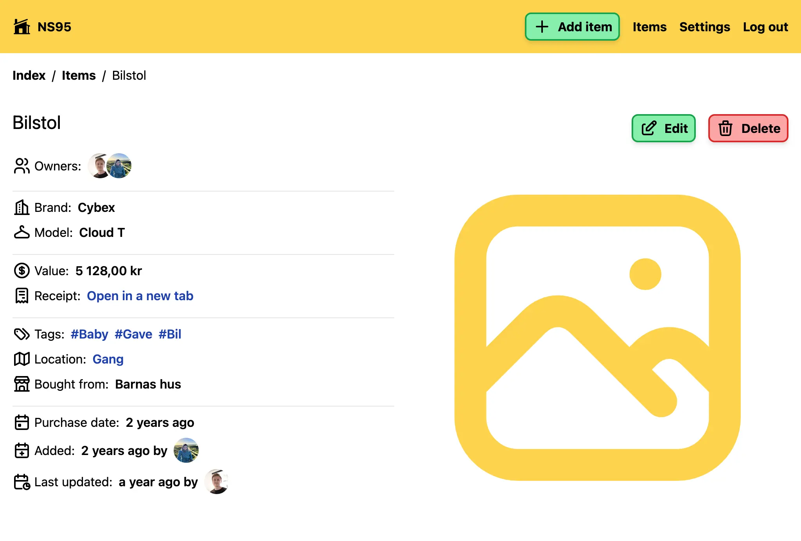
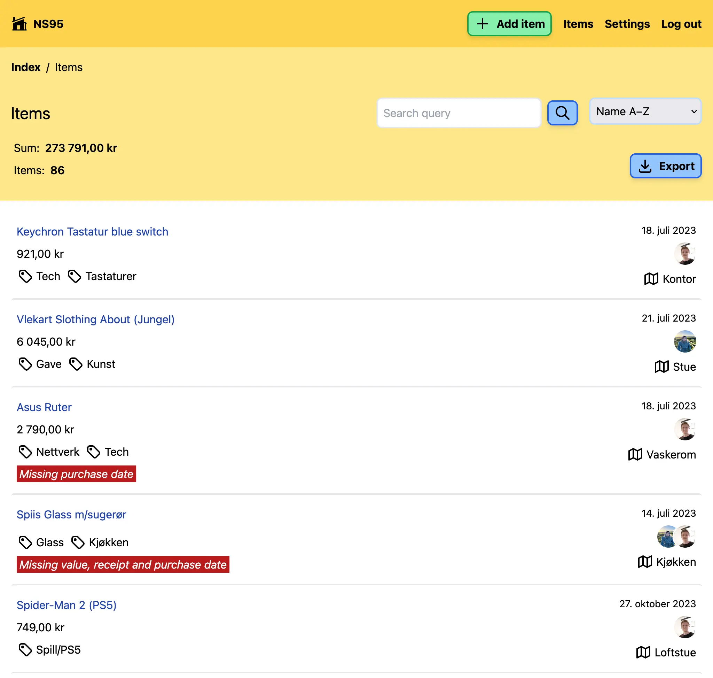
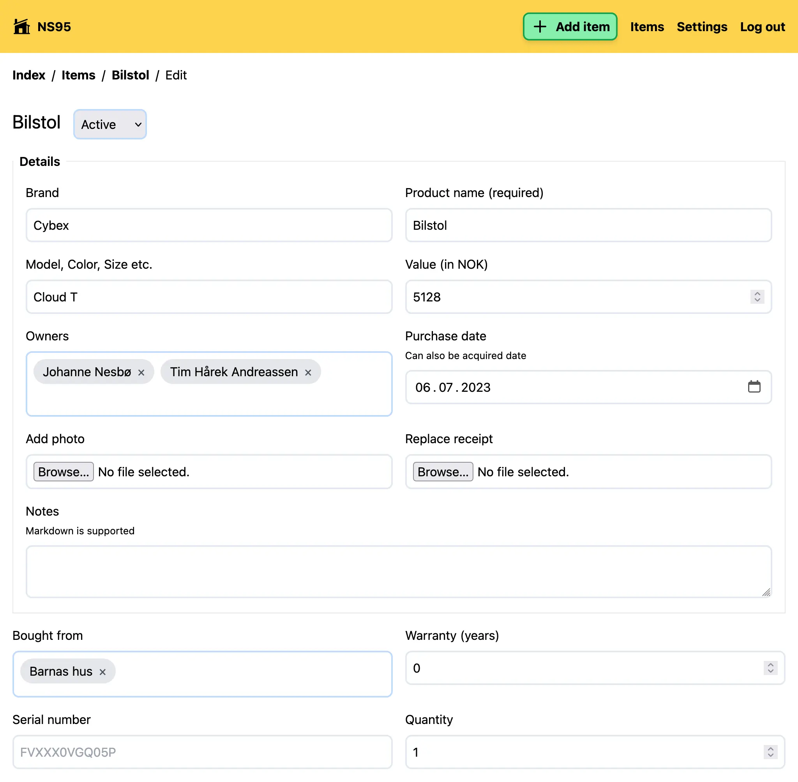
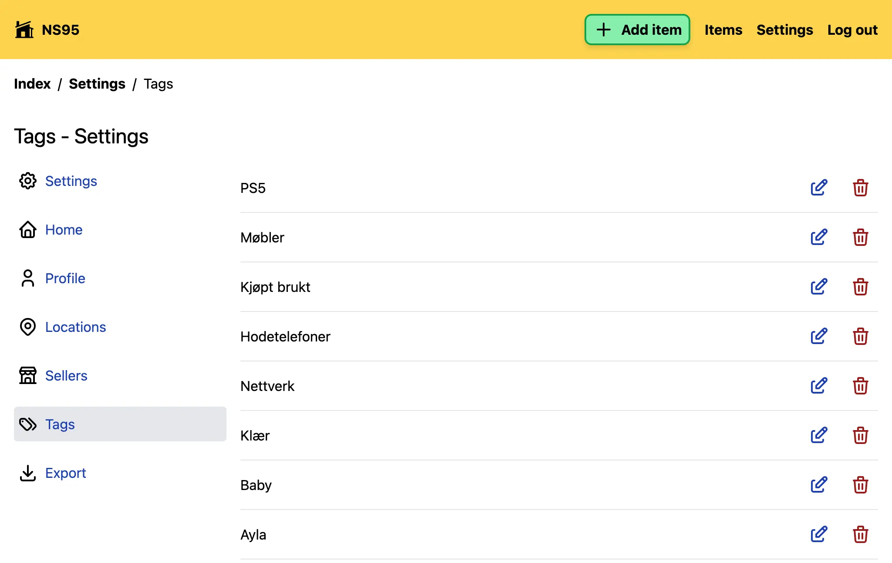
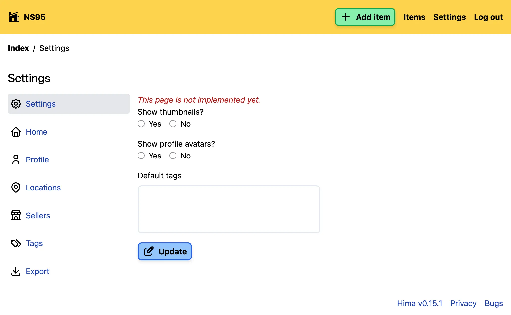
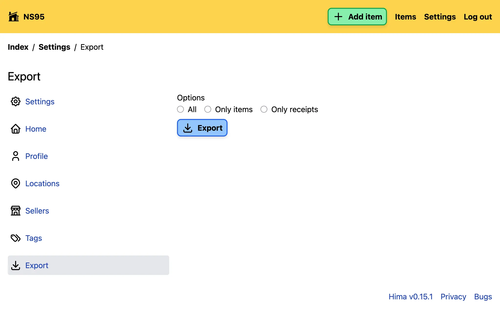
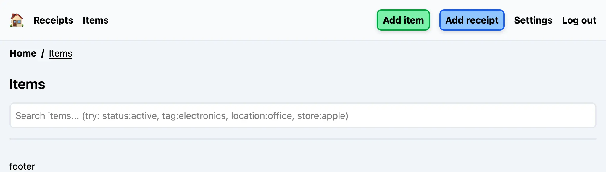
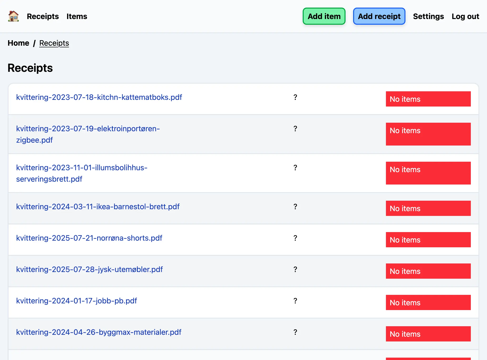

+++
title = "Hima devlog #0"
description = "After more than two years of development, it's time to properly write about my passion project."
tags = ["Devlogs", "Hima", "Programming"]
+++

Home Inventory Management Application, or [Hima] for short, has been my passion
project since April 2023. It is what the name says, an inventory management app
for stuff in your home.

This initial devlog will lay the groundwork for what Hima is, and what I want it
to become. Future devlogs will be some kind of design docs and discussion
starters for how I want to progress the project.

## Why

After I finished my compulsory military service, moved to my own apartment and
started studying in 2017, I wanted to keep track of all my stuff. I didn't have
that much, and I figured now that no one would take care of this for me anyway.
What if someone breaks in, a fire, water damage etc. A lot can happen. I found
an macOS application called
[Home Inventory](https://apps.apple.com/au/app/home-inventory-4/id1124615151?mt=12).
I started using it, but man did it take a loooot of time to input everything.

Fast-forward to 2023 I was tired of being unable to update my inventory with my
phone or just another device. Then I decided I wanted to create something that I
could access through the web. I came up with **Hima** as the name before I came
up with the meaning, which in retrospect fits perfectly: Home Inventory
Management Application.

## Project history

The project started out with a backend with [PocketBase] (PB), and [Deno's
Fresh] as the frontend. I decided on PB early because it had user-auth built-in
and had a GUI for maintaining the database, and an added bonus was that it was a
single binary. Fresh was chosen because of its original `#nobuild` promise
(which has since been forgotten), and Deno had TypeScript as a first-class
citizen.

Everything started out entirely server-side rendered with Fresh. I used PB as
backend where I interacted directly with the database. PB worked great for
debugging stuff in the beginning, I could quickly iterate on how to configure
the needed fields for `Item` and what was needed like tags, categories, rooms,
etc.

I haven't had a new release in 11 months, but my SO and I still use Hima when we
buy new stuff. So the current release has been stable for a long time.

## Current features

### Items

The core of the idea is items. You can add tags, which room the item is located
in, brand, model, receipt etc.

<figure>
  
  <figcaption>
    Current item page
  </figcaption>
</figure>

<figure>
  
  <figcaption>
    Current items overview page
  </figcaption>
</figure>

<figure>
  
  <figcaption>
    Current item edit page
  </figcaption>
</figure>

### Homes

Another concept in Hima is that you can have multiple homes, useful if you have
a vacation home, or just want to keep stuff in order for someone else. It's
directly related to items, an item has to have an associated home.

But the data about the home is nothing more than a name and address.

### Tags

I initially started out with categories and tags, but categories felt too rigid,
so I just went with the latter. Super-useful for combining stuff and search.

<figure>
  
  <figcaption>
    Current tags system
  </figcaption>
</figure>

### Settings

There are more stuff:

- Sellers
- Locations

Nothing special, just a single value (mostly) stored and an optional property to
be associated with an item.

<figure>
  
  <figcaption>
    Current settings stuff
  </figcaption>
</figure>

### Export

This is something I spent a long time on, making it easy to export everything.
My end-goal is making it possible to export everything with photos and receipts
into a single PDF that I can send to an insurance company if something happens.

<figure>
  
  <figcaption>
    Current export page
  </figcaption>
</figure>

### And much more

- Home-switcher
- Invitation system for user registration
- Search
- Filters
- Warranty notifications

And I think this is part of what stopped me from releasing another version for
11 months.

## Current deployment and hosting strategy

I use SourceHut Builds to deploy everything onto a VPS where I have systemd
listening for file changes that initiates a restart of another systemd-process
that runs Hima with Deno and another process that runs PB.

I'm well aware of that this is not ideal, but it has worked for more than two
years. My friend, [Mathias](https://mathiash98.github.io/), helped me make Hima
work with Docker. I have only tested it out locally, both with a single
Dockerfile and a compose-file. It runs both Hima and PB. But for now the current
release will continue to run on bare-metal.

## End goal

My end-goal for Hima is to make it easy to keep track of what I have, what I
paid and its warranty. I want to do the least amount of stuff manually.

## Who's this for

Me. It started out like that, but feature-creep started to happen and I started
to procrastinate. But first and foremost, I make this for myself. If someone
else likes the idea, that's really cool!

## Moving on

I'm currently remaking Hima in Go using [templ](https://templ.guide) for
rendering the frontend and SQLite with [GORM](https://gorm.io/) for storing
everything. However, after starting to write this devlog I have started to
sketch out a simpler remake, still with Go and templ, but relying much more on
the local file-system. Moving on I want to write one devlog per month to keep
myself accountable for "finishing" it. The next devlog will have a set of goals
for what I want to be available for a `v1`.

<figure>
  
  <figcaption>
    Sneak peek of new items page
  </figcaption>
</figure>

<figure>
  
  <figcaption>
    Sneak peek of new receipts page
  </figcaption>
</figure>

## Disclaimer

In 2024 I discovered a Norwegian attempt to solve my problems, although with an
app, called [Tings](https://tings.com/). As of writing they have nuked all the
content on their site, but it's basically a personal inventory app powered by an
AI to do all the hard work for you. I wasn't aware of the app before I started
working on Hima.
