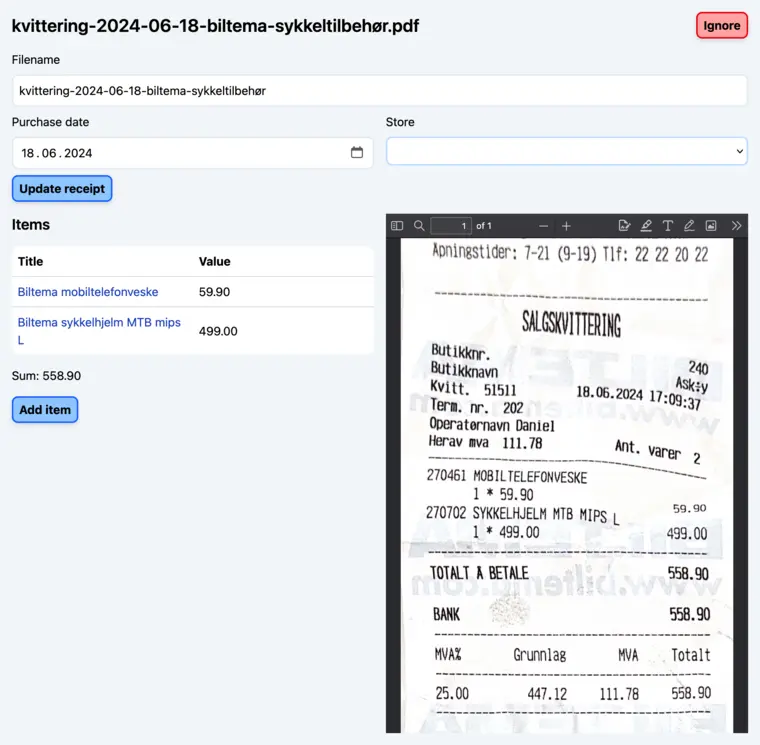

+++
title = "Hima Devlog #1"
description = "Simplifying everything, everything is a file."
tags = ["Hima", "Devlogs", "Programming"]
+++

You should read the [first devlog](/blog/hima-devlog-0) before reading this
devlog. There I explain what Hima is and my motivation behind the project.

On January 25th 2025 I started to rewrite Hima. My initial reason was just to
port everything to Go with all the stuff that I had learned along the way, but
it quickly became much more than a rewrite. It has become a full-blown remake in
Go.

## Receipts and items are separate

One thing that I quickly learned was that receipts can have multiple items, I
did of course already know this, but I didn't think of this for my initial
implementation of `Item`. Therefore, when a receipt had multiple items, I had to
reuse the same receipt multiple times. Even with compression, this was dumb.

Now however, receipts, and items are their own entities. A receipt can have many
items, and an item can only have one receipt.

When you are processing a receipt, you can see a preview of its content in your
browser when you're adding its items to Hima.

<figure>
  
  <figcaption>
    Screenshot of how you process a receipt.
  </figcaption>
</figure>

You can still add items without receipts, it's not a required relation.

## Everything is a file

One of the shortcomings of my initial version of Hima was that I was locked to
PocketBase when it came to auth, database-stuff, deployment, and probably more.

In 2024 I used SQLite for a couple of small projects, like a wedding-invitation
webapp, where I wrote every SQL query by hand, and did most things manually. It
was more work than I expected, but in the end I ended up having a lot more
control over the data. I was able to quickly check the production database in a
local environment, and when I had to migrate to a new server it was a simple
`rsync`/`scp` command away.

So now almost everything is in SQLite, we'll get back to why it's "almost"
everything.

When I started this rewrite I had everything in the database, users, items,
receipts, tags, locations, you name it. Everything had a strong relation and it
was easy to move around. But then [copyparty](https://github.com/9001/copyparty)
[went viral on YouTube](https://www.youtube.com/watch?v=15_-hgsX2V0). It was
stupid simple. It runs off a single file, that gives you a powerful file-server
that works on anything. That's when I realized that Hima's receipts shouldn't be
locked inside a SQLite database file. They should be available from the user's
filesystem of choice.

All the receipts come from the filesystem and is indexed by Hima for adding
items to each receipt.

## Configuration

I originally wanted to do this in the database, but copyparty showed me the way.
You should be able to quickly configure how Hima should work. You want to add a
new user? Add it to the config. You need to add a new tag? You can add it to
config, or via the web UI (which updates the config).

Do you use a specific pattern for naming your receipts? Well, I have good news
for you. You can specify your own groups for parsing receipt's filenames. I
usually name my receipts like this:

`receipt-2025-10-05-store-description-of-what-i-bought.ext`

In my config it would look like this:

```toml
[receipt_parsing]
pattern = "^receipt-(\\d{4}-\\d{2}-\\d{2})-([^-]+)-(.+)\\.pdf$"
date_format = "2006-01-02"
groups = ["date", "store", "description"]
prefix = "receipt"
extension = ".pdf"
```

## Repository pattern

Originally, Hima was one my first big projects, where I hadn't done a lot of
database stuff with a bunch of moving parts. Which resulted in me passing around
PocketBase's client to every part of the application so that I could get, list,
create, update, and delete items, users, and so on. This was not ideal.

For my rewrite I chose to use an ORM, [GORM](https://gorm.io/). I provide the
struct, and GORM handles the rest. And since I'm using Go, I don't want to pass
around a database struct so that I can access the database. And when my coworker
told me about the repository pattern, I knew that I had to use it for Hima.

Here's how I implemented it:

```go
type Client struct {
	db *gorm.DB

	Item    *itemRepository
}

type itemRepository struct {
	db *gorm.DB
}

func newItemRepository(db *gorm.DB) *itemRepository {
	return &itemRepository{db: db}
}

func (r *itemRepository) Create(item *Item) error {
	return r.preloadItem().Create(item).Error
}

func (r *itemRepository) Get(id uint) (*Item, error) {
	var item Item
	err := r.preloadItem().First(&item, id).Error
	if err != nil {
		return nil, fmt.Errorf("item: failed to get item with id %d: %w", id, err)
	}
	return &item, nil
}

func (r *itemRepository) Update(item *Item) error {
	return r.preloadItem().Save(item).Error
}

func (r *itemRepository) Delete(id uint) error {
	return r.db.Delete(&Item{}, id).Error
}
```

This makes it so that when I want to do something with an `Item`, I can use my
database `Client`:

```go
func main() {
  c := NewClient()

  if err := c.Item.Delete(69); err != nil {
    panic(err)
  }
}
```

This makes the API easy to understand, test, and extend. And the stuff
interacting with the `Client` doesn't need to know anything about GORM or the
database.

## What remains?

There's a lot of stuff that [remains][todos] to do, and the list will probably
grow as I continue to use the new iteration. One of the things I want to tackle
next is the
[queue/power through](https://todo.sr.ht/~timharek/hima/67#event-432846)
feature, which will make tidying up the items and receipts much smoother. I also
want a "native" way to
[add footers to my tables](https://todo.sr.ht/~timharek/hima/89). I also need to
figure out what my end goal looks like, or maybe this project will last
"forever".

## Want to help out?

If you want to help me develop Hima, you can do so by checking out my
[contributing guidelines](https://git.sr.ht/~timharek/hima/tree/HEAD/CONTRIBUTING.md).
Everyone is welcome to contribute!

I'm making Hima first and foremost to satisfy my own needs, but it's always
helpful to get other's input.

And please create new tickets in the project's [todos], I will review and reply
to everything.

[todos]: https://todo.sr.ht/~timharek/hima
