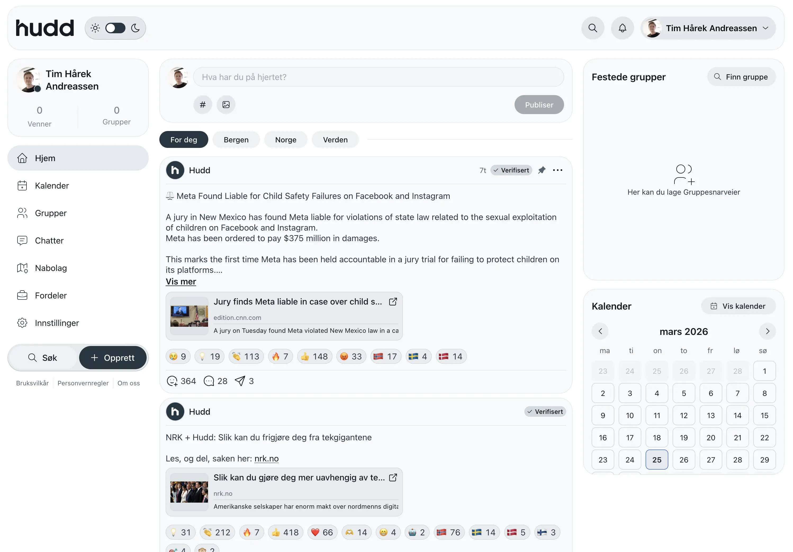
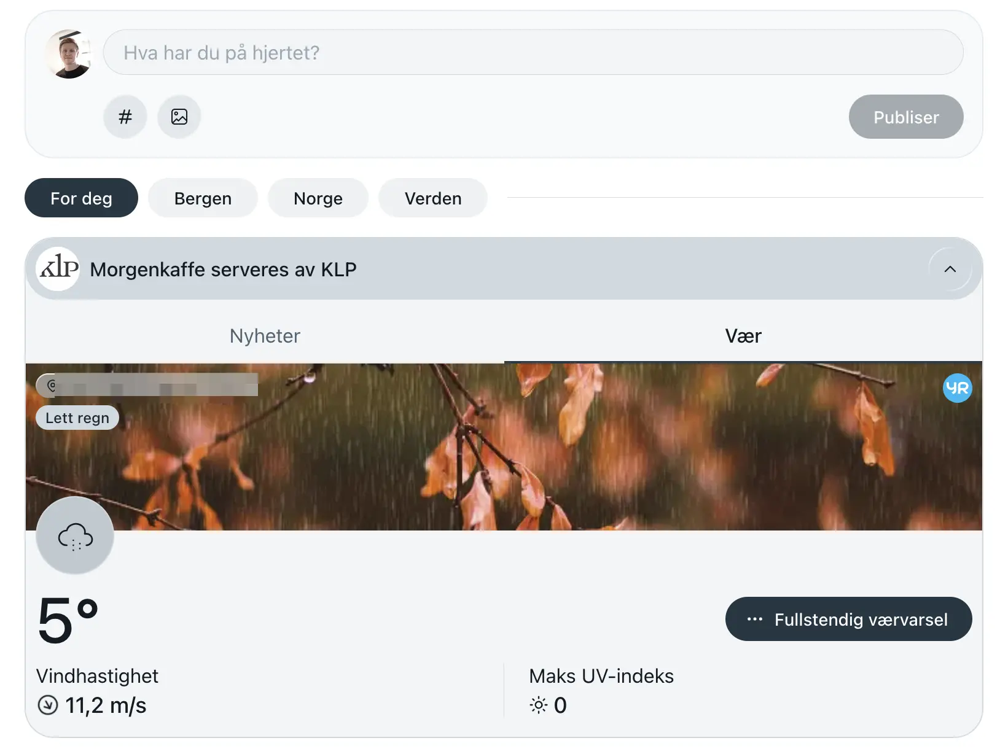
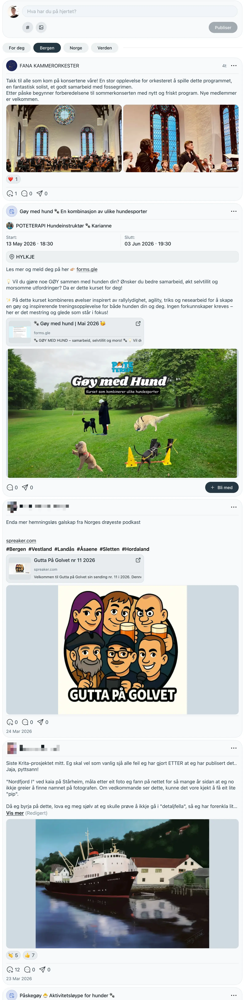
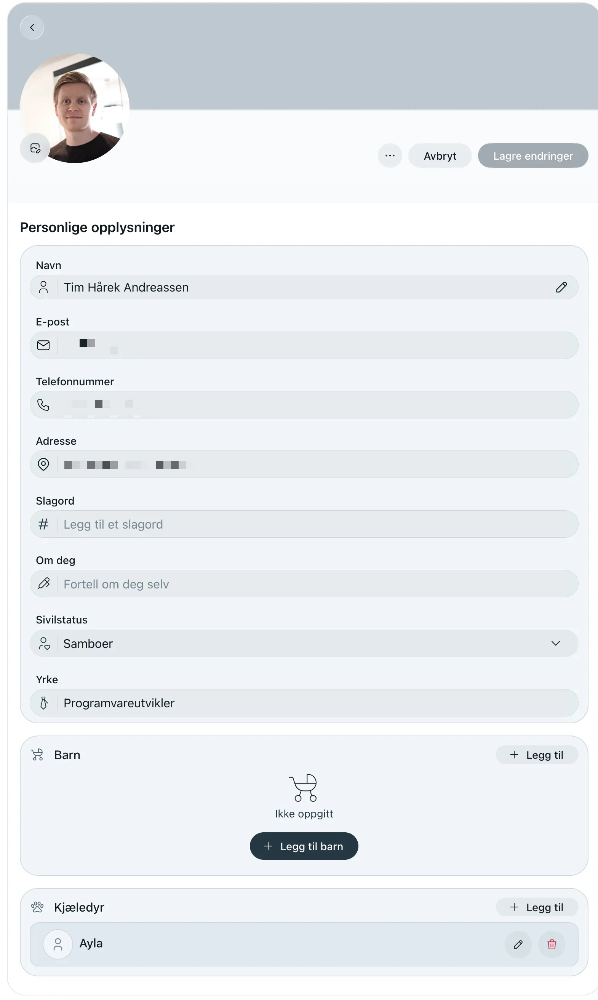
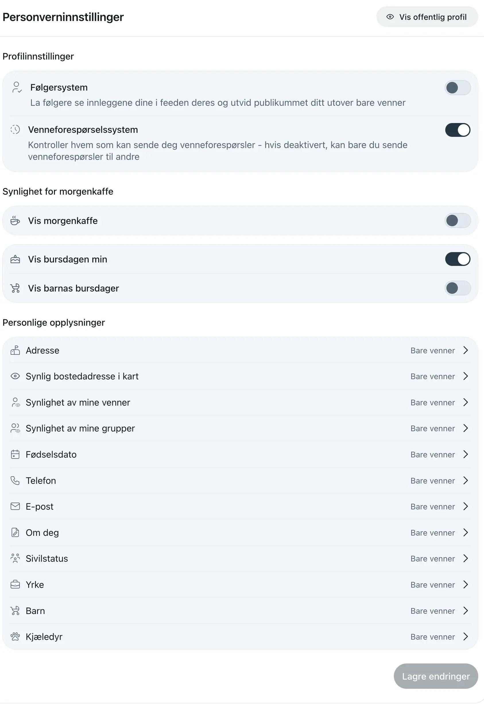
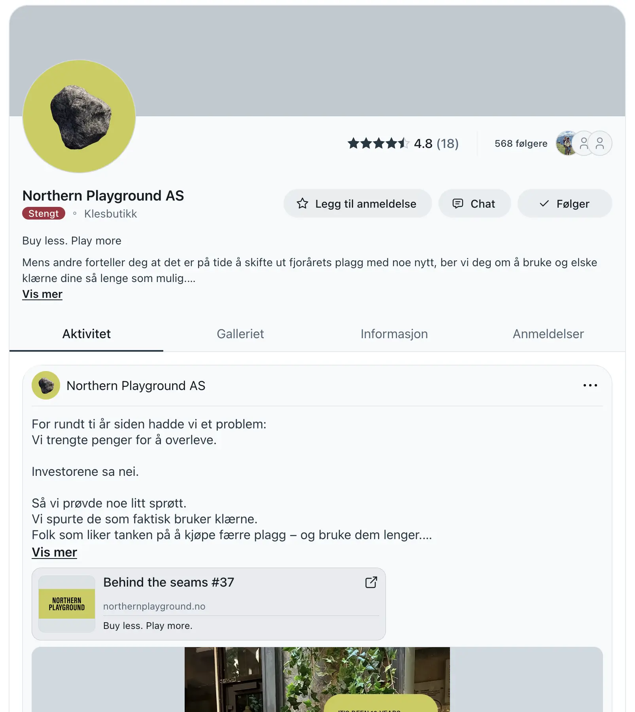
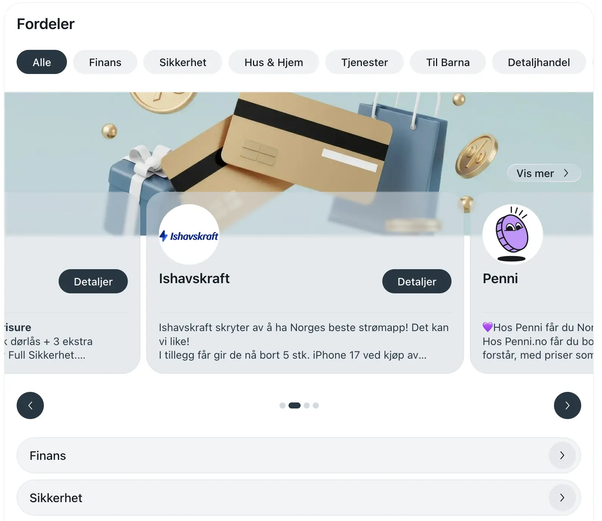
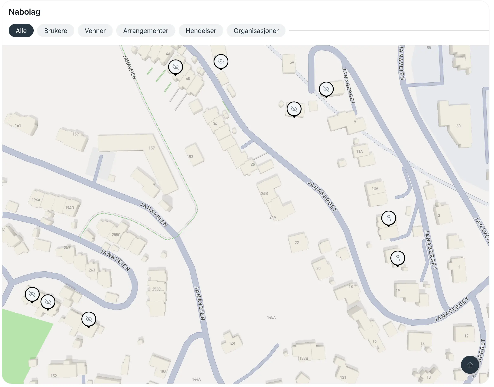

+++
title = "Hudd review"
description = "A quick overview and review of Hudd, the Norwegian social media platform alternative to Facebook."
tags = ["Social Media", "Review"]
+++

Lately, there has been a lot of talk about moving away from US-based services,
and social media platforms in general. Norway's broadcasting channel, NRK, wrote
yesterday [about how to break free from the tech giants]. In my circle it seems
like a bunch of people read this and gave some thought to it. Once again
reminded about the Norwegian alternative to Facebook, [Hudd].

## What is Hudd?

Hudd markets themselves as a Norwegian, no-ads, non-addictive, actually social,
etc., alternative to Facebook. To make it more "safe", you have to sign up using
a (kinda) national ID of some sort. Hudd is available in Norway, Denmark, and
Sweden. I can only speak for Norway, and here we are required to use a private
identity provider, Vipps, to sign up and log in to Hudd. They require your full
name, social security number, e-mail, phone number, and full address.

## Why did I sign up?

I've been curious to see what Hudd is. It's a very walled garden, because you
cannot share anything outside of the platform (at least that I know of). The
images I have seen of it have looked a lot like mockups or something similar. I
haven't used social media since late 2021 after I
[left Facebook](/blog/goodbye-facebook), and when I visited their website I saw
that they had recently added a web-version of the platform, so I didn't need to
install another app.

## Review

<abbr title="Too long; didn't read">TL;DR</abbr> is that I have sent their
support a question about how I can delete my account. I was reminded how much I
hated Facebook and that I actually never want a Facebook-alternative. All the
reactions, the attention-based posts, companies begging for attention, people
posting their statuses in the comment section of a post. In addition, the
neighborhood thing was spooky. It turns out you are supposed to see the names of
all your neighbors on the map with their name, and you can actually see everyone
in all the countries, WTF. You can disable sharing your name, but you then just
appear as an "anonymous user" at your actual address.

### Signing up

The sign up process was pretty good, except that I had to use Vipps. I think
they used BankID before, but I guess Vipps MobilePay AS, the owners of Vipps and
BankID, have different fees for their login stuff, so they switched.

I didn't actually have to fill in anything, because they had all the data they
needed from Vipps.

### The feed

After I signed in I was presented with my "feed". I was expecting an empty feed
for a service that doesn't serve ads. But I guess Hudd themselves are the
exception?

<figure>
  
  <figcaption>
    Screenshot of my Hudd feed.
  </figcaption>
</figure>

I forgot to take the initial screenshot of what the feed looks like if you don't
disable "morning coffee", a daily digest where they serve you your local weather
and an ad. But I enabled it after initially signing up for the review's sake.

<figure>
  
  <figcaption>
    Screenshot of the "morning coffee" feed with weather and an ad.
  </figcaption>
</figure>

Instead of my feed being empty, it was filled with stuff from Hudd where they
shared anti-Facebook articles, articles where Hudd was mentioned, people
praising Hudd on Hudd, etc. Not too bad. But I can't unfollow them? WTF. I have
to see this?

There's also a "local" feed, in my case that's Bergen, and it was OK. It had a
few personal posts from people, some events coming up and companies in the area
sharing photos. Not too bad. The "Norway"- and "World"-feeds were pretty much
the same.

<figure>
  
  <figcaption>
    Screenshot of the local feed.
  </figcaption>
</figure>

### Profile

The profile is just a simple wall, where you can post statuses, and see all the
posts you have had in other groups. You can update your details:

- Profile picture
- Phone number
- E-mail
- Bio
- Relationship status
- A list of your children
- A list of your pets

You cannot edit:

- Full address
- Birth date

<figure>
  
  <figcaption>
    Screenshot of the profile edit page.
  </figcaption>
</figure>

It's a bit weird being able to list your children on a social media platform,
because you don't "link" it to another Hudd-profile, it's a static list you
create. Is it for bragging rights? Is for not forgetting you have kids? WTF.

### Privacy/settings

The settings and privacy stuff is pretty sparse, but I think it might be enough,
except you should be able to turn off ALL the ads, especially on a platform
advertising themselves as an ad-free alternative.

<figure>
  
  <figcaption>
    Screenshot of the privacy settings.
  </figcaption>
</figure>

One thing to note here in the settings, is that I'm unable to find a way to
delete my user/profile. I have contacted their support for assistance here, but
this should be
[available by law](https://www.datatilsynet.no/personvern-pa-ulike-omrader/internett-og-apper/sletting-av-profilar/#:~:text=Du%20har%20rett,Du%20kan%20kva).

### Pages

You can follow companies like on any other social media, but the cool thing here
is that the company actually has to pay to be on Hudd. I think this is a great
incentive! They get the first month for free, and then NOK 399 per month
afterward. If you are a "one-person business", it's NOK 199 per month.

<figure>
  
  <figcaption>
    Screenshot of a company page.
  </figcaption>
</figure>

### Benefits

I was surprised when I saw this page, Fordeler
(benefits). This is a bunch of ads for different companies where you get
discounts, coupons, etc. They have ads for insurance, credit cards, smartwatches
for kids, and much more. What the actual fuck.

<figure>
  
  <figcaption>
    Screenshot of the benefits page.
  </figcaption>
</figure>

### Neighborhood

This is what scares me the most. I can literally see all my neighbors that have
signed up for Hudd, regardless if they share their name or have chosen to stay
anonymous. If you want to be anonymous or not, there will still appear an avatar
on the actual address on the map.

<figure>
  
  <figcaption>
    Screenshot of the neighborhood map.
  </figcaption>
</figure>

I guess some people like this, but throughout my review of Hudd it has been made
clear to me that I am not the target audience here.

### Privacy and terms of use

Holy shit, these are pretty good! I could read them in under five minutes, both!
I have never seen anyone have such short and clear privacy declaration and terms
of use pages. This should be the norm.

## Conclusion

I'm deleting my account, as fast as possible. I'm not impressed by all the ads,
and the ads are a clear indication that making social media platforms is not
profitable, unless you do shady stuff. The neighborhood stuff is very shady, and
it makes the platform seem stalker-friendly for people to find each other using
their profiles and actual addresses.

However, for people who actually want a Facebook-like experience, Hudd is a much
better alternative. But this review made it clear to me that I don't want that
experience at all, social media platforms as a whole are flawed, especially
since they just copy each other and make addiction into a currency.

[about how to break free from the tech giants]:
  https://www.nrk.no/norge/slik-kan-du-gjore-deg-mer-uavhengig-av-teknologigigantene-1.17800060
[Hudd]: https://hudd.no
